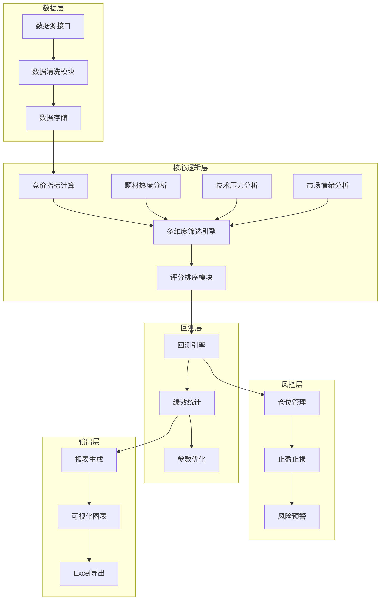

# 设计文档

## 概述

竞价溢价策略评估系统是一个基于Python的量化策略研究工具，用于验证"竞价阶段资金承接强度与次日溢价"的相关性假设。系统采用模块化设计，支持数据采集、多维度筛选、回测评估和风险控制。

## 架构

系统采用分层架构设计：



## 组件与接口

### 1. 数据采集模块 (DataCollector)

```python
class DataCollector:
    """数据采集接口"""
    
    def fetch_auction_data(self, date: str) -> pd.DataFrame:
        """
        获取指定日期的竞价数据
        
        Args:
            date: 交易日期，格式 'YYYY-MM-DD'
        
        Returns:
            DataFrame包含: stock_code, auction_low, auction_high, 
                          open_price, auction_volume, auction_amount,
                          prev_close, float_shares
        """
        pass
    
    def fetch_daily_data(self, stock_code: str, start_date: str, end_date: str) -> pd.DataFrame:
        """获取日线数据用于技术分析"""
        pass
    
    def fetch_sector_data(self, date: str) -> pd.DataFrame:
        """获取板块概念数据"""
        pass
    
    def fetch_limit_up_data(self, date: str) -> pd.DataFrame:
        """获取涨跌停数据"""
        pass
```

### 2. 指标计算模块 (IndicatorCalculator)

```python
class IndicatorCalculator:
    """竞价指标计算"""
    
    def calc_auction_spread(self, open_price: float, auction_low: float, prev_close: float) -> float:
        """
        计算竞价价差
        
        公式: (open_price/prev_close - 1) - (auction_low/prev_close - 1)
             = (open_price - auction_low) / prev_close
        """
        pass
    
    def calc_auction_turnover(self, auction_volume: int, float_shares: int) -> float:
        """计算竞价换手率"""
        pass
    
    def calc_next_day_premium(self, next_open: float, today_close: float) -> float:
        """计算次日溢价率"""
        pass
```

### 3. 筛选引擎 (FilterEngine)

```python
@dataclass
class FilterConfig:
    """筛选配置"""
    spread_top_n: int = 20
    min_auction_amount: float = 500  # 万元
    min_auction_turnover: float = 0.5  # %
    min_market_cap: float = 5  # 亿
    max_market_cap: float = 500  # 亿
    min_list_days: int = 60

class FilterEngine:
    """多维度筛选引擎"""
    
    def __init__(self, config: FilterConfig):
        self.config = config
    
    def apply_basic_filters(self, df: pd.DataFrame) -> pd.DataFrame:
        """应用基础筛选条件"""
        pass
    
    def apply_auction_filters(self, df: pd.DataFrame) -> pd.DataFrame:
        """应用竞价指标筛选"""
        pass
    
    def filter_by_sector_heat(self, df: pd.DataFrame, sector_analyzer: 'SectorAnalyzer') -> pd.DataFrame:
        """按板块热度筛选"""
        pass
    
    def filter_by_pressure(self, df: pd.DataFrame, pressure_analyzer: 'PressureAnalyzer') -> pd.DataFrame:
        """按技术压力筛选"""
        pass
```

### 4. 题材热度分析 (SectorAnalyzer)

```python
@dataclass
class SectorHeat:
    """板块热度数据"""
    sector_name: str
    limit_up_count: int
    trend_5d: str  # 'rising', 'stable', 'falling'
    heat_level: str  # 'main_rise', 'active', 'normal', 'cooling'

class SectorAnalyzer:
    """题材热度分析"""
    
    def analyze_sector_heat(self, sector_name: str, date: str) -> SectorHeat:
        """分析单个板块热度"""
        pass
    
    def get_stock_sectors(self, stock_code: str) -> List[str]:
        """获取个股所属板块"""
        pass
    
    def calc_limit_up_trend(self, sector_name: str, date: str, days: int = 5) -> str:
        """计算涨停趋势"""
        pass
```

### 5. 技术压力分析 (PressureAnalyzer)

```python
@dataclass
class PressureLevel:
    """压力位分析结果"""
    stock_code: str
    current_price: float
    high_60d: float
    distance_to_high: float  # 百分比
    dense_zone_low: float
    dense_zone_high: float
    pressure_level: str  # 'high', 'medium', 'low'

class PressureAnalyzer:
    """技术压力分析"""
    
    def analyze_pressure(self, stock_code: str, date: str) -> PressureLevel:
        """分析个股压力位"""
        pass
    
    def calc_dense_zone(self, daily_data: pd.DataFrame) -> Tuple[float, float]:
        """计算成交密集区（成交量加权）"""
        pass
```

### 6. 市场情绪分析 (MarketEmotionAnalyzer)

```python
@dataclass
class MarketEmotion:
    """市场情绪数据"""
    date: str
    limit_up_count: int
    limit_down_count: int
    emotion_score: float  # -1 到 1
    emotion_level: str  # 'strong', 'neutral', 'weak'
    is_extreme: bool

class MarketEmotionAnalyzer:
    """市场情绪分析"""
    
    def analyze_emotion(self, date: str) -> MarketEmotion:
        """分析当日市场情绪"""
        pass
    
    def is_extreme_market(self, limit_up: int, limit_down: int) -> bool:
        """判断是否极端市场"""
        return limit_up > 500 or limit_down > 500
```

### 7. 回测引擎 (BacktestEngine)

```python
@dataclass
class BacktestResult:
    """回测结果"""
    total_trades: int
    win_rate: float
    avg_premium: float
    median_premium: float
    max_drawdown: float
    profit_loss_ratio: float
    max_consecutive_loss: int
    daily_details: pd.DataFrame

class BacktestEngine:
    """回测引擎"""
    
    def run_backtest(self, start_date: str, end_date: str, config: FilterConfig) -> BacktestResult:
        """执行回测"""
        pass
    
    def calc_performance_metrics(self, trades: pd.DataFrame) -> Dict[str, float]:
        """计算绩效指标"""
        pass
```

### 8. 风控模块 (RiskController)

```python
@dataclass
class RiskConfig:
    """风控配置"""
    max_daily_picks: int = 3
    max_position_ratio: float = 0.3
    stop_loss_ratio: float = -0.03
    take_profit_ratio: float = 0.05
    max_consecutive_loss: int = 5

class RiskController:
    """风险控制"""
    
    def __init__(self, config: RiskConfig):
        self.config = config
        self.consecutive_loss = 0
    
    def check_position_limit(self, current_positions: int) -> bool:
        """检查持仓数量限制"""
        pass
    
    def check_stop_loss(self, entry_price: float, current_price: float) -> bool:
        """检查止损条件"""
        pass
    
    def check_take_profit(self, entry_price: float, current_price: float) -> bool:
        """检查止盈条件"""
        pass
    
    def update_consecutive_loss(self, is_loss: bool) -> None:
        """更新连续亏损计数"""
        pass
    
    def should_pause_strategy(self, emotion: MarketEmotion) -> bool:
        """判断是否暂停策略"""
        pass
```

## 数据模型

### 竞价数据表 (auction_data)

| 字段 | 类型 | 说明 |
|------|------|------|
| date | DATE | 交易日期 |
| stock_code | VARCHAR(10) | 股票代码 |
| stock_name | VARCHAR(50) | 股票名称 |
| prev_close | DECIMAL(10,2) | 前收盘价 |
| auction_low | DECIMAL(10,2) | 竞价最低价 |
| auction_high | DECIMAL(10,2) | 竞价最高价 |
| open_price | DECIMAL(10,2) | 开盘价 |
| auction_volume | BIGINT | 竞价成交量 |
| auction_amount | DECIMAL(15,2) | 竞价成交额 |
| auction_spread | DECIMAL(8,4) | 竞价价差 |
| auction_turnover | DECIMAL(8,4) | 竞价换手率 |
| is_limit_up_open | BOOLEAN | 是否涨停开盘 |

### 筛选结果表 (filter_results)

| 字段 | 类型 | 说明 |
|------|------|------|
| date | DATE | 交易日期 |
| stock_code | VARCHAR(10) | 股票代码 |
| auction_spread | DECIMAL(8,4) | 竞价价差 |
| auction_amount | DECIMAL(15,2) | 竞价金额 |
| auction_turnover | DECIMAL(8,4) | 竞价换手 |
| sector_heat | VARCHAR(20) | 板块热度 |
| pressure_level | VARCHAR(20) | 压力等级 |
| board_height | INT | 连板高度 |
| composite_score | DECIMAL(8,4) | 综合评分 |
| next_day_premium | DECIMAL(8,4) | 次日溢价 |

### 配置表 (strategy_config)

| 字段 | 类型 | 说明 |
|------|------|------|
| config_name | VARCHAR(50) | 配置名称 |
| spread_top_n | INT | 价差排名前N |
| min_auction_amount | DECIMAL(15,2) | 最小竞价金额 |
| min_auction_turnover | DECIMAL(8,4) | 最小竞价换手 |
| min_market_cap | DECIMAL(15,2) | 最小市值 |
| max_market_cap | DECIMAL(15,2) | 最大市值 |
| created_at | DATETIME | 创建时间 |


## 正确性属性

*正确性属性是系统应该在所有有效执行中保持为真的特征或行为——本质上是关于系统应该做什么的形式化陈述。属性作为人类可读规范和机器可验证正确性保证之间的桥梁。*

### Property 1: 竞价指标计算正确性

*For any* 有效的竞价数据（前收盘价、竞价最低价、开盘价、竞价成交量、流通股本），计算得到的 Auction_Spread 应等于 (open_price - auction_low) / prev_close，Auction_Turnover 应等于 auction_volume / float_shares * 100

**Validates: Requirements 1.3, 1.4**

### Property 2: 筛选条件一致性

*For any* 经过筛选引擎处理后的结果集，所有个股应满足：Auction_Amount >= 配置阈值，Auction_Turnover >= 配置阈值，流通市值在 [min_market_cap, max_market_cap] 范围内，上市天数 >= 60，且不包含ST标记

**Validates: Requirements 2.2, 2.3, 2.4, 2.5, 2.6**

### Property 3: 排名筛选正确性

*For any* Auction_Spread 排名前N的筛选结果，结果数量应 <= N，且结果按 Auction_Spread 降序排列，任何未入选的个股其 Auction_Spread 应 <= 结果集中的最小值

**Validates: Requirements 2.1**

### Property 4: 板块热度分类正确性

*For any* 板块热度分析结果，当涨停家数 >= 3 且趋势为上升时应标记为"主升期"，当涨停家数 >= 2 且趋势为平稳时应标记为"活跃期"，其他情况标记为"正常"或"退潮"

**Validates: Requirements 3.4, 3.5**

### Property 5: 涨停趋势计算正确性

*For any* 5日涨停数据序列，当后3日平均 > 前2日平均 * 1.2 时应判定为"上升"，当变化在 ±20% 内时应判定为"平稳"，否则判定为"下降"

**Validates: Requirements 3.3**

### Property 6: 压力等级分类正确性

*For any* 个股的价格和成交密集区数据，当当前价格 < 密集区下沿 * 0.9 时应标记为"压力较大"，当当前价格 > 密集区上沿时应标记为"压力较小"

**Validates: Requirements 4.3, 4.4**

### Property 7: 成交密集区计算正确性

*For any* 60日日线数据，成交密集区应为成交量加权的价格区间，密集区下沿 <= 密集区上沿

**Validates: Requirements 4.2**

### Property 8: 市场情绪分类正确性

*For any* 涨停家数和跌停家数，Market_Emotion = (涨停 - 跌停) / (涨停 + 跌停)，当 > 0.5 时标记"强势"，0~0.5 时标记"中性"，< 0 时标记"弱势"

**Validates: Requirements 5.3, 5.4, 5.5, 5.6**

### Property 9: 连板高度计算正确性

*For any* 个股的历史涨停数据，Board_Height 应等于从当日向前连续涨停的天数，中断则归零

**Validates: Requirements 5.1**

### Property 10: 次日溢价计算正确性

*For any* 当日收盘价和次日开盘价，Next_Day_Premium = (next_open - today_close) / today_close

**Validates: Requirements 6.2**

### Property 11: 胜率计算正确性

*For any* 交易记录集合，胜率 = 溢价为正的交易数 / 总交易数，且胜率值在 [0, 1] 范围内

**Validates: Requirements 6.3**

### Property 12: 绩效指标计算正确性

*For any* 溢价率序列，平均溢价率 = sum(溢价率) / count，中位数溢价率为排序后的中间值，盈亏比 = 平均盈利 / 平均亏损的绝对值

**Validates: Requirements 6.4, 6.5**

### Property 13: 止盈止损信号正确性

*For any* 买入价和当前价，当 (current - entry) / entry <= stop_loss_ratio 时应触发止损，当 >= take_profit_ratio 时应触发止盈

**Validates: Requirements 8.3, 8.4**

### Property 14: 选股数量限制正确性

*For any* 单日筛选结果，返回的个股数量应 <= max_daily_picks 配置值

**Validates: Requirements 8.1**

### Property 15: 连续亏损计数正确性

*For any* 交易序列，连续亏损次数应正确累计，盈利后归零，达到阈值时触发预警

**Validates: Requirements 8.6, 8.7**

### Property 16: 弱势市场行为正确性

*For any* 市场情绪为"弱势"的交易日，系统应降低选股数量至1只或暂停选股

**Validates: Requirements 5.7, 8.5**

### Property 17: 复牌股排除正确性

*For any* 筛选结果，不应包含当日为复牌首日的个股

**Validates: Requirements 9.1**

### Property 18: 极端市场识别正确性

*For any* 涨停或跌停家数超过500的交易日，应标记为"极端市场"并暂停或调整策略

**Validates: Requirements 9.3, 9.4**

### Property 19: 除权除息数据处理正确性

*For any* 存在除权除息的个股，其竞价数据应被正确复权或排除

**Validates: Requirements 9.5**

### Property 20: 配置保存加载往返一致性

*For any* 有效的策略配置对象，保存后再加载应得到等价的配置对象

**Validates: Requirements 10.5**

### Property 21: 涨停开盘标记正确性

*For any* 个股的开盘价和涨停价，当 open_price >= limit_up_price 时应标记为涨停竞价股

**Validates: Requirements 1.5**

### Property 22: 输出字段完整性

*For any* 候选股票输出记录，应包含所有筛选维度的数值和风险提示字段

**Validates: Requirements 7.1, 7.5**

### Property 23: 综合评分排序正确性

*For any* 候选股票列表，应按综合评分降序排列，评分相同时按 Auction_Spread 降序

**Validates: Requirements 7.2**

## 错误处理

### 数据层错误

| 错误类型 | 处理方式 |
|---------|---------|
| 数据源连接失败 | 重试3次，失败后记录日志并使用缓存数据 |
| 数据格式异常 | 记录异常数据，跳过该条记录继续处理 |
| 数据缺失 | 标记为不完整数据，不参与筛选 |
| 除权除息数据 | 自动复权处理或排除 |

### 计算层错误

| 错误类型 | 处理方式 |
|---------|---------|
| 除零错误 | 返回 None 或 0，标记为无效数据 |
| 数值溢出 | 使用 Decimal 类型，设置合理精度 |
| 类型转换失败 | 记录日志，使用默认值或跳过 |

### 业务层错误

| 错误类型 | 处理方式 |
|---------|---------|
| 无符合条件的个股 | 返回空列表，记录当日市场状态 |
| 板块数据缺失 | 跳过板块热度评估，使用其他维度 |
| 极端市场状态 | 暂停策略，发出预警通知 |

## 测试策略

### 单元测试

- 测试所有指标计算函数的边界情况
- 测试筛选条件的组合逻辑
- 测试风控模块的触发条件
- 测试数据清洗的异常处理

### 属性测试

使用 Hypothesis 库进行属性测试：

```python
from hypothesis import given, strategies as st

@given(
    prev_close=st.floats(min_value=1, max_value=1000),
    auction_low=st.floats(min_value=0.9, max_value=1.1),  # 相对于prev_close的比例
    open_price=st.floats(min_value=0.9, max_value=1.1)
)
def test_auction_spread_calculation(prev_close, auction_low_ratio, open_ratio):
    """Property 1: 竞价指标计算正确性"""
    auction_low = prev_close * auction_low_ratio
    open_price = prev_close * open_ratio
    
    spread = calc_auction_spread(open_price, auction_low, prev_close)
    expected = (open_price - auction_low) / prev_close
    
    assert abs(spread - expected) < 1e-10
```

### 回测验证

- 使用历史数据验证策略逻辑
- 对比不同参数组合的绩效
- 验证风控机制的有效性

### 测试配置

- 属性测试最少运行 100 次迭代
- 每个属性测试需标注对应的设计属性编号
- 标签格式: **Feature: auction-premium-strategy, Property {number}: {property_text}**
