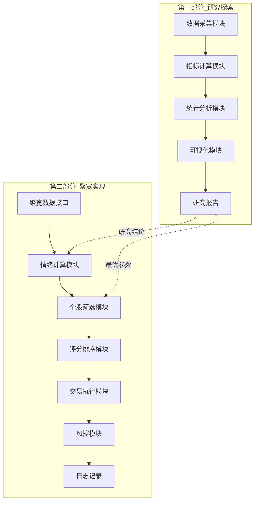
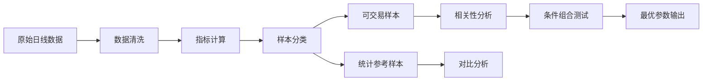

# 设计文档

## 概述

本项目是一个基于市场情绪的A股隔夜溢价策略研究与实现系统，分为两个阶段：
1. **研究探索阶段**：使用Python进行历史数据分析，挖掘市场情绪与个股特征对隔夜溢价的影响规律
2. **策略实现阶段**：在聚宽(JoinQuant)平台实现完整的隔夜溢价交易策略

系统不依赖L2数据，仅使用日线级别数据和市场情绪指标。

## 架构

### 整体架构



### 研究阶段数据流



## 组件与接口

### 第一部分：研究探索模块

#### 1. 数据采集模块 (ResearchDataCollector)

```python
class ResearchDataCollector:
    """研究阶段数据采集"""
    
    def fetch_daily_data(self, start_date: str, end_date: str) -> pd.DataFrame:
        """
        获取日线数据
        
        Returns:
            DataFrame包含: date, stock_code, open, high, low, close, 
                          volume, amount, prev_close
        """
        pass
    
    def fetch_limit_data(self, start_date: str, end_date: str) -> pd.DataFrame:
        """
        获取涨跌停数据
        
        Returns:
            DataFrame包含: date, stock_code, is_limit_up, is_limit_down,
                          is_once_limit_up (曾涨停)
        """
        pass
    
    def fetch_sector_data(self, start_date: str, end_date: str) -> pd.DataFrame:
        """获取板块数据"""
        pass
    
    def fetch_stock_info(self) -> pd.DataFrame:
        """获取股票基本信息（上市日期、是否ST等）"""
        pass
```

#### 2. 指标计算模块 (IndicatorCalculator)

```python
@dataclass
class StockIndicators:
    """个股指标"""
    stock_code: str
    date: str
    change_pct: float          # 涨跌幅
    turnover_rate: float       # 换手率
    volume_ratio: float        # 量比
    amplitude: float           # 振幅
    close_position: float      # 收盘位置
    market_cap: float          # 流通市值
    is_limit_up: bool          # 是否涨停
    is_once_limit_up: bool     # 是否曾涨停
    change_5d: float           # 近5日涨幅
    distance_to_high_20d: float # 距20日高点距离

@dataclass
class MarketIndicators:
    """市场情绪指标"""
    date: str
    limit_up_count: int        # 涨停家数
    limit_down_count: int      # 跌停家数
    limit_ratio: float         # 涨跌停比
    up_count: int              # 上涨家数
    down_count: int            # 下跌家数
    up_down_ratio: float       # 涨跌家数比
    max_board_height: int      # 最高连板高度
    board_stock_count: int     # 连板股数量
    avg_change: float          # 市场平均涨幅
    seal_rate: float           # 封板率

class IndicatorCalculator:
    """指标计算器"""
    
    def calc_stock_indicators(self, daily_data: pd.DataFrame) -> pd.DataFrame:
        """计算个股指标"""
        pass
    
    def calc_market_indicators(self, daily_data: pd.DataFrame, 
                                limit_data: pd.DataFrame) -> pd.DataFrame:
        """计算市场情绪指标"""
        pass
    
    def calc_overnight_premium(self, daily_data: pd.DataFrame) -> pd.DataFrame:
        """
        计算隔夜溢价率
        公式: (次日开盘价 - 当日收盘价) / 当日收盘价
        """
        pass
    
    def calc_close_position(self, high: float, low: float, close: float) -> float:
        """
        计算收盘位置
        公式: (close - low) / (high - low)
        """
        if high == low:
            return 0.5
        return (close - low) / (high - low)
    
    def calc_volume_ratio(self, volume: float, avg_volume_5d: float) -> float:
        """计算量比"""
        if avg_volume_5d == 0:
            return 0
        return volume / avg_volume_5d
```

#### 3. 样本分类模块 (SampleClassifier)

```python
@dataclass
class ClassifiedSamples:
    """分类后的样本"""
    tradable: pd.DataFrame      # 可交易样本（非涨停）
    limit_up: pd.DataFrame      # 涨停样本
    once_limit_up: pd.DataFrame # 炸板样本
    all_samples: pd.DataFrame   # 全部样本

class SampleClassifier:
    """样本分类器"""
    
    def classify(self, data: pd.DataFrame) -> ClassifiedSamples:
        """
        将样本分为可交易样本和统计参考样本
        
        可交易样本：收盘时非涨停的个股
        统计参考样本：涨停股、炸板股
        """
        pass
    
    def filter_valid_samples(self, data: pd.DataFrame) -> pd.DataFrame:
        """过滤有效样本（排除ST、新股、停牌等）"""
        pass
```

#### 4. 统计分析模块 (StatisticalAnalyzer)

```python
@dataclass
class CorrelationResult:
    """相关性分析结果"""
    factor_name: str
    correlation: float
    p_value: float
    ic_mean: float
    ic_std: float
    icir: float

@dataclass
class GroupStats:
    """分组统计结果"""
    group_name: str
    sample_count: int
    win_rate: float
    avg_premium: float
    median_premium: float
    std_premium: float

class StatisticalAnalyzer:
    """统计分析器"""
    
    def calc_correlation(self, factor: pd.Series, premium: pd.Series) -> CorrelationResult:
        """计算因子与溢价的相关性"""
        pass
    
    def calc_ic_series(self, factor: pd.Series, premium: pd.Series) -> pd.Series:
        """计算IC序列"""
        pass
    
    def group_analysis(self, data: pd.DataFrame, group_col: str, 
                       premium_col: str, bins: list) -> List[GroupStats]:
        """分组统计分析"""
        pass
    
    def compare_samples(self, tradable: pd.DataFrame, 
                        limit_up: pd.DataFrame) -> pd.DataFrame:
        """对比可交易样本与涨停样本的溢价差异"""
        pass
```

#### 5. 条件组合测试模块 (ConditionTester)

```python
@dataclass
class TestResult:
    """测试结果"""
    conditions: dict
    sample_count: int
    win_rate: float
    avg_premium: float
    median_premium: float
    sharpe_ratio: float

class ConditionTester:
    """条件组合测试器"""
    
    def test_single_condition(self, data: pd.DataFrame, 
                               condition: dict) -> TestResult:
        """测试单一条件"""
        pass
    
    def test_combination(self, data: pd.DataFrame, 
                          conditions: List[dict]) -> TestResult:
        """测试条件组合"""
        pass
    
    def grid_search(self, data: pd.DataFrame, 
                    param_grid: dict) -> List[TestResult]:
        """网格搜索最优参数"""
        pass
    
    def find_best_conditions(self, results: List[TestResult], 
                              min_samples: int = 100) -> TestResult:
        """找出最优条件组合"""
        pass
```

#### 6. 可视化模块 (Visualizer)

```python
class Visualizer:
    """可视化模块"""
    
    def plot_emotion_premium_relation(self, data: pd.DataFrame) -> None:
        """绘制市场情绪与溢价关系图"""
        pass
    
    def plot_factor_scatter(self, factor: pd.Series, premium: pd.Series, 
                            factor_name: str) -> None:
        """绘制因子与溢价散点图"""
        pass
    
    def plot_heatmap(self, results: pd.DataFrame) -> None:
        """绘制条件组合胜率热力图"""
        pass
    
    def plot_premium_distribution(self, premium: pd.Series, title: str) -> None:
        """绘制溢价分布直方图"""
        pass
    
    def generate_report(self, analysis_results: dict, output_path: str) -> None:
        """生成研究报告"""
        pass
```

### 第二部分：聚宽策略模块

#### 7. 聚宽数据接口 (JQDataFetcher)

```python
class JQDataFetcher:
    """聚宽数据接口封装"""
    
    def get_daily_price(self, stock_list: List[str], date: str) -> pd.DataFrame:
        """获取日线行情"""
        pass
    
    def get_limit_up_stocks(self, date: str) -> List[str]:
        """获取涨停股列表"""
        pass
    
    def get_limit_down_stocks(self, date: str) -> List[str]:
        """获取跌停股列表"""
        pass
    
    def get_sector_stocks(self, sector_code: str) -> List[str]:
        """获取板块成分股"""
        pass
    
    def get_market_cap(self, stock_list: List[str], date: str) -> pd.DataFrame:
        """获取流通市值"""
        pass
    
    def get_stock_info(self, stock_list: List[str]) -> pd.DataFrame:
        """获取股票基本信息"""
        pass
```

#### 8. 市场情绪计算模块 (EmotionCalculator)

```python
@dataclass
class EmotionState:
    """市场情绪状态"""
    date: str
    emotion_index: float       # 综合情绪指数
    emotion_level: str         # 情绪等级: strong/neutral/weak
    emotion_cycle: str         # 情绪周期: startup/ferment/climax/retreat
    is_tradable: bool          # 是否适合交易

class EmotionCalculator:
    """市场情绪计算器"""
    
    def __init__(self, config: dict):
        self.config = config
    
    def calc_emotion_index(self, market_data: MarketIndicators) -> float:
        """
        计算综合情绪指数
        公式由研究阶段确定
        """
        pass
    
    def classify_emotion_level(self, emotion_index: float) -> str:
        """分类情绪等级"""
        pass
    
    def detect_emotion_cycle(self, emotion_history: List[float]) -> str:
        """检测情绪周期"""
        pass
    
    def is_tradable_day(self, emotion_state: EmotionState) -> bool:
        """判断是否适合交易"""
        pass
```

#### 9. 个股筛选模块 (StockFilter)

```python
@dataclass
class FilterConfig:
    """筛选配置（由研究阶段确定）"""
    min_change_pct: float = 3.0
    max_change_pct: float = 9.5
    min_turnover: float = 3.0
    max_turnover: float = 20.0
    min_close_position: float = 0.7
    min_market_cap: float = 20e8
    max_market_cap: float = 200e8
    min_volume_ratio: float = 1.5

class StockFilter:
    """个股筛选器"""
    
    def __init__(self, config: FilterConfig):
        self.config = config
    
    def filter_stocks(self, stock_data: pd.DataFrame, 
                      sector_data: pd.DataFrame) -> pd.DataFrame:
        """执行筛选"""
        pass
    
    def exclude_limit_up(self, data: pd.DataFrame) -> pd.DataFrame:
        """排除涨停股"""
        pass
    
    def exclude_st_new(self, data: pd.DataFrame) -> pd.DataFrame:
        """排除ST和新股"""
        pass
    
    def filter_by_sector(self, data: pd.DataFrame, 
                         strong_sectors: List[str]) -> pd.DataFrame:
        """按板块筛选"""
        pass
```

#### 10. 评分排序模块 (Scorer)

```python
@dataclass
class ScoreConfig:
    """评分权重配置（由研究阶段确定）"""
    sector_weight: float = 0.3
    change_weight: float = 0.25
    turnover_weight: float = 0.2
    position_weight: float = 0.15
    volume_ratio_weight: float = 0.1

class Scorer:
    """评分排序器"""
    
    def __init__(self, config: ScoreConfig):
        self.config = config
    
    def calc_score(self, stock_data: pd.DataFrame) -> pd.DataFrame:
        """计算综合得分"""
        pass
    
    def rank_stocks(self, scored_data: pd.DataFrame, top_n: int) -> pd.DataFrame:
        """排序并返回前N只"""
        pass
```

#### 11. 交易执行模块 (TradeExecutor)

```python
@dataclass
class TradeSignal:
    """交易信号"""
    stock_code: str
    direction: str  # 'buy' or 'sell'
    price: float
    amount: int
    reason: str

class TradeExecutor:
    """交易执行器（聚宽框架）"""
    
    def __init__(self, context):
        self.context = context
    
    def execute_buy(self, signals: List[TradeSignal]) -> None:
        """执行买入"""
        pass
    
    def execute_sell_all(self) -> None:
        """次日开盘全部卖出"""
        pass
    
    def calc_position_size(self, stock_code: str, 
                           emotion_state: EmotionState) -> float:
        """计算仓位大小"""
        pass
```

#### 12. 风控模块 (RiskController)

```python
@dataclass
class RiskConfig:
    """风控配置"""
    max_daily_loss: float = 0.03
    max_consecutive_loss: int = 3
    max_position_per_stock: float = 0.2
    pause_on_weak_emotion: bool = True
    pause_on_retreat_cycle: bool = True

class RiskController:
    """风险控制器"""
    
    def __init__(self, config: RiskConfig):
        self.config = config
        self.consecutive_loss = 0
    
    def should_trade(self, emotion_state: EmotionState) -> bool:
        """判断是否应该交易"""
        pass
    
    def check_daily_loss(self, daily_pnl: float) -> bool:
        """检查单日亏损"""
        pass
    
    def update_consecutive_loss(self, is_loss: bool) -> None:
        """更新连续亏损计数"""
        pass
    
    def get_max_stocks(self, emotion_state: EmotionState) -> int:
        """根据情绪获取最大选股数量"""
        pass
```

## 数据模型

### 日线数据表 (daily_data)

| 字段 | 类型 | 说明 |
|------|------|------|
| date | DATE | 交易日期 |
| stock_code | VARCHAR(10) | 股票代码 |
| open | DECIMAL(10,2) | 开盘价 |
| high | DECIMAL(10,2) | 最高价 |
| low | DECIMAL(10,2) | 最低价 |
| close | DECIMAL(10,2) | 收盘价 |
| volume | BIGINT | 成交量 |
| amount | DECIMAL(15,2) | 成交额 |
| prev_close | DECIMAL(10,2) | 前收盘价 |

### 个股指标表 (stock_indicators)

| 字段 | 类型 | 说明 |
|------|------|------|
| date | DATE | 交易日期 |
| stock_code | VARCHAR(10) | 股票代码 |
| change_pct | DECIMAL(8,4) | 涨跌幅 |
| turnover_rate | DECIMAL(8,4) | 换手率 |
| volume_ratio | DECIMAL(8,4) | 量比 |
| amplitude | DECIMAL(8,4) | 振幅 |
| close_position | DECIMAL(8,4) | 收盘位置 |
| market_cap | DECIMAL(15,2) | 流通市值 |
| is_limit_up | BOOLEAN | 是否涨停 |
| is_once_limit_up | BOOLEAN | 是否曾涨停 |
| overnight_premium | DECIMAL(8,4) | 隔夜溢价率 |

### 市场情绪表 (market_emotion)

| 字段 | 类型 | 说明 |
|------|------|------|
| date | DATE | 交易日期 |
| limit_up_count | INT | 涨停家数 |
| limit_down_count | INT | 跌停家数 |
| limit_ratio | DECIMAL(8,4) | 涨跌停比 |
| up_count | INT | 上涨家数 |
| down_count | INT | 下跌家数 |
| up_down_ratio | DECIMAL(8,4) | 涨跌家数比 |
| max_board_height | INT | 最高连板高度 |
| emotion_index | DECIMAL(8,4) | 综合情绪指数 |
| emotion_level | VARCHAR(20) | 情绪等级 |
| emotion_cycle | VARCHAR(20) | 情绪周期 |

### 研究结果表 (research_results)

| 字段 | 类型 | 说明 |
|------|------|------|
| condition_id | INT | 条件组合ID |
| condition_desc | TEXT | 条件描述 |
| sample_count | INT | 样本数量 |
| win_rate | DECIMAL(8,4) | 胜率 |
| avg_premium | DECIMAL(8,4) | 平均溢价 |
| median_premium | DECIMAL(8,4) | 中位数溢价 |
| sharpe_ratio | DECIMAL(8,4) | 夏普比率 |


## 正确性属性

*正确性属性是系统应该在所有有效执行中保持为真的特征或行为——本质上是关于系统应该做什么的形式化陈述。属性作为人类可读规范和机器可验证正确性保证之间的桥梁。*

### Property 1: 隔夜溢价计算正确性

*For any* 有效的当日收盘价和次日开盘价，隔夜溢价率应等于 (next_open - today_close) / today_close

**Validates: Requirements 1.4**

### Property 2: 涨跌停比计算正确性

*For any* 涨停家数和跌停家数，涨跌停比应等于 limit_up_count / (limit_up_count + limit_down_count + 1)，且结果在 [0, 1) 范围内

**Validates: Requirements 2.2**

### Property 3: 涨跌家数比计算正确性

*For any* 上涨家数和下跌家数，涨跌家数比应等于 up_count / (up_count + down_count)，且结果在 [0, 1] 范围内

**Validates: Requirements 2.4**

### Property 4: 个股指标计算正确性

*For any* 有效的日线数据（开高低收、成交量、前收盘价），以下指标计算应正确：
- 涨跌幅 = (close - prev_close) / prev_close
- 振幅 = (high - low) / prev_close
- 收盘位置 = (close - low) / (high - low)，当 high = low 时返回 0.5

**Validates: Requirements 3.1, 3.4, 3.5**

### Property 5: 量比计算正确性

*For any* 当日成交量和近5日平均成交量，量比应等于 volume / avg_volume_5d，当 avg_volume_5d = 0 时返回 0

**Validates: Requirements 3.3**

### Property 6: 连板高度计算正确性

*For any* 个股的历史涨停数据序列，连板高度应等于从当日向前连续涨停的天数，中断则归零

**Validates: Requirements 2.5**

### Property 7: 封板率计算正确性

*For any* 收盘涨停家数和曾涨停家数，封板率应等于 seal_count / once_limit_up_count，且结果在 [0, 1] 范围内

**Validates: Requirements 2.8**

### Property 8: 样本分类正确性

*For any* 经过分类的样本集，可交易样本中不应包含收盘涨停的个股，涨停样本中所有个股应为收盘涨停状态

**Validates: Requirements 3.10, 5.1**

### Property 9: 数据过滤正确性

*For any* 经过过滤的数据集，不应包含ST、*ST标记的个股，不应包含上市不足20日的新股

**Validates: Requirements 1.5**

### Property 10: 相关系数范围正确性

*For any* 计算得到的相关系数，其值应在 [-1, 1] 范围内

**Validates: Requirements 5.2**

### Property 11: 胜率计算正确性

*For any* 交易记录集合，胜率 = 溢价为正的交易数 / 总交易数，且胜率值在 [0, 1] 范围内

**Validates: Requirements 6.6, 14.3**

### Property 12: 筛选条件一致性

*For any* 经过筛选引擎处理后的结果集，所有个股应满足：
- 非收盘涨停
- 涨幅在 [min_change_pct, max_change_pct] 范围内
- 换手率在 [min_turnover, max_turnover] 范围内
- 收盘位置 >= min_close_position
- 流通市值在 [min_market_cap, max_market_cap] 范围内

**Validates: Requirements 10.1, 10.2, 10.3, 10.4, 10.5**

### Property 13: 评分排序正确性

*For any* 候选股票列表，应按综合得分降序排列，得分相同时保持稳定排序

**Validates: Requirements 11.3**

### Property 14: 情绪等级分类正确性

*For any* 综合情绪指数，当 > 阈值上限时标记"强势"，在阈值区间内标记"中性"，< 阈值下限时标记"弱势"

**Validates: Requirements 9.6**

### Property 15: 选股数量限制正确性

*For any* 单日筛选结果，返回的个股数量应 <= 当前情绪等级对应的最大选股数量

**Validates: Requirements 12.4**

### Property 16: 连续亏损计数正确性

*For any* 交易序列，连续亏损次数应正确累计，盈利后归零，达到阈值时触发预警

**Validates: Requirements 13.4**

### Property 17: 弱势市场暂停交易正确性

*For any* 市场情绪为"弱势"或情绪周期为"退潮期"的交易日，系统应暂停或减少交易

**Validates: Requirements 13.1, 13.2**

### Property 18: 涨停标记正确性

*For any* 个股的收盘价和涨停价，当 close >= limit_up_price * 0.999 时应标记为涨停

**Validates: Requirements 3.7**

## 错误处理

### 数据层错误

| 错误类型 | 处理方式 |
|---------|---------|
| 数据源连接失败 | 重试3次，失败后记录日志并跳过当日 |
| 数据格式异常 | 记录异常数据，跳过该条记录继续处理 |
| 数据缺失 | 标记为不完整数据，不参与分析 |
| 停牌数据 | 自动识别并排除 |

### 计算层错误

| 错误类型 | 处理方式 |
|---------|---------|
| 除零错误 | 返回默认值（0或0.5），标记为边界情况 |
| 数值溢出 | 使用 Decimal 类型，设置合理精度 |
| 类型转换失败 | 记录日志，使用默认值或跳过 |

### 业务层错误

| 错误类型 | 处理方式 |
|---------|---------|
| 无符合条件的个股 | 返回空列表，记录当日市场状态 |
| 板块数据缺失 | 跳过板块筛选，使用其他维度 |
| 极端市场状态 | 暂停策略，发出预警通知 |

## 测试策略

### 单元测试

- 测试所有指标计算函数的边界情况
- 测试筛选条件的组合逻辑
- 测试样本分类的正确性
- 测试数据清洗的异常处理

### 属性测试

使用 Hypothesis 库进行属性测试：

```python
from hypothesis import given, strategies as st

@given(
    today_close=st.floats(min_value=1, max_value=1000),
    next_open_ratio=st.floats(min_value=0.9, max_value=1.1)
)
def test_overnight_premium_calculation(today_close, next_open_ratio):
    """Property 1: 隔夜溢价计算正确性"""
    next_open = today_close * next_open_ratio
    
    premium = calc_overnight_premium(next_open, today_close)
    expected = (next_open - today_close) / today_close
    
    assert abs(premium - expected) < 1e-10

@given(
    high=st.floats(min_value=1, max_value=100),
    low=st.floats(min_value=1, max_value=100),
    close=st.floats(min_value=1, max_value=100)
)
def test_close_position_calculation(high, low, close):
    """Property 4: 收盘位置计算正确性"""
    # 确保 high >= low
    if high < low:
        high, low = low, high
    # 确保 close 在 [low, high] 范围内
    close = max(low, min(high, close))
    
    position = calc_close_position(high, low, close)
    
    if high == low:
        assert position == 0.5
    else:
        expected = (close - low) / (high - low)
        assert abs(position - expected) < 1e-10
        assert 0 <= position <= 1
```

### 回测验证

- 使用历史数据验证策略逻辑
- 对比不同参数组合的绩效
- 验证风控机制的有效性

### 测试配置

- 属性测试最少运行 100 次迭代
- 每个属性测试需标注对应的设计属性编号
- 标签格式: **Feature: overnight-premium-emotion, Property {number}: {property_text}**

