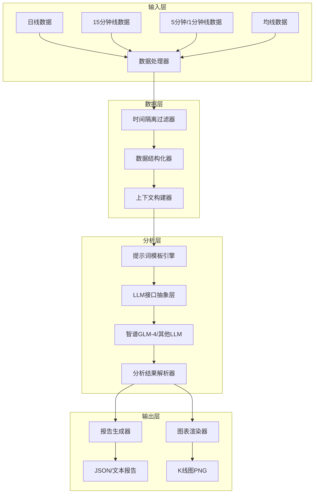

# Design Document: 大盘分析Agent

## Overview

大盘分析Agent是一个基于LLM的智能技术分析系统，通过多时间周期的上证指数数据，由LLM自动识别支撑压力位并给出走势预期。系统采用分层架构，将数据处理、LLM分析和结果输出解耦，核心分析逻辑由LLM通过精心设计的提示词完成。

### 核心设计理念

1. **LLM驱动分析**：支撑压力位识别、走势预期等核心分析由LLM完成，而非硬编码算法
2. **提示词工程为核心**：系统的核心价值在于提示词和上下文的设计
3. **数据时间隔离**：严格防止未来数据泄露
4. **可扩展LLM接口**：支持多种LLM提供商

## Architecture



## Components and Interfaces

### 1. LLM接口抽象层 (LLMProvider)

```python
from abc import ABC, abstractmethod
from dataclasses import dataclass
from typing import Optional, Dict, Any, List

@dataclass
class LLMConfig:
    provider: str  # "zhipu", "openai", "claude", "qwen"
    model: str  # "glm-4", "gpt-4", "claude-3", "qwen-max"
    api_key: str
    temperature: float = 0.3
    max_tokens: int = 4096
    timeout: int = 60
    max_retries: int = 3

@dataclass
class LLMMessage:
    role: str  # "system", "user", "assistant"
    content: str

@dataclass
class LLMResponse:
    content: str
    usage: Dict[str, int]  # {"prompt_tokens": x, "completion_tokens": y}
    model: str

class LLMProvider(ABC):
    @abstractmethod
    def chat(self, messages: List[LLMMessage]) -> LLMResponse:
        """发送消息并获取响应"""
        pass
    
    @abstractmethod
    def validate_config(self) -> bool:
        """验证配置是否有效"""
        pass

class ZhipuProvider(LLMProvider):
    """智谱GLM-4实现（默认）"""
    pass

class OpenAIProvider(LLMProvider):
    """OpenAI GPT实现"""
    pass

class LLMFactory:
    @staticmethod
    def create(config: LLMConfig) -> LLMProvider:
        """根据配置创建对应的LLM提供商"""
        pass
```

### 2. 数据模型 (DataModels)

```python
from dataclasses import dataclass
from datetime import datetime
from typing import List, Optional
from enum import Enum

class TimeFrame(Enum):
    DAILY = "daily"      # 日线
    M15 = "m15"          # 15分钟
    M5 = "m5"            # 5分钟
    M1 = "m1"            # 1分钟

@dataclass
class OHLCV:
    timestamp: datetime
    open: float
    high: float
    low: float
    close: float
    volume: float

@dataclass
class MovingAverage:
    timestamp: datetime
    ma5: Optional[float]
    ma10: Optional[float]
    ma20: Optional[float]
    ma60: Optional[float]
    ma120: Optional[float]

@dataclass
class MarketData:
    timeframe: TimeFrame
    data: List[OHLCV]
    moving_averages: Optional[List[MovingAverage]]
    
@dataclass
class AnalysisInput:
    analysis_date: datetime  # 分析截止日期
    analysis_time: Optional[datetime]  # 盘中模式的截止时间
    daily_data: MarketData
    m15_data: MarketData
    m5_data: MarketData
    m1_data: MarketData
    current_price: float
```

### 2.1 Tushare数据源 (TushareDataSource)

```python
from dataclasses import dataclass
from datetime import datetime, date
from typing import Optional
import tushare as ts

@dataclass
class TushareConfig:
    """Tushare配置"""
    api_token: str
    index_code: str = "000001.SH"  # 上证指数
    daily_days: int = 252   # 日线数据交易日数（约一年）
    m15_days: int = 20      # 15分钟线交易日数（约一个月）
    m5_days: int = 5        # 5分钟线交易日数（约一周）
    m1_days: int = 1        # 1分钟线交易日数（当日）

    def validate(self) -> tuple[bool, Optional[str]]:
        """验证配置"""
        if not self.api_token:
            return False, "api_token不能为空"
        if not self.index_code:
            return False, "index_code不能为空"
        return True, None


class TushareDataSource:
    """Tushare数据源 - 获取上证指数多周期数据"""
    
    def __init__(self, config: TushareConfig):
        self.config = config
        self._pro: Optional[ts.pro_api] = None
    
    def _get_api(self) -> ts.pro_api:
        """获取Tushare Pro API"""
        if self._pro is None:
            ts.set_token(self.config.api_token)
            self._pro = ts.pro_api()
        return self._pro
    
    def get_trade_calendar(self, start_date: date, end_date: date) -> List[date]:
        """获取交易日历"""
        pass
    
    def get_daily_data(self, end_date: date) -> MarketData:
        """获取日线数据（按交易日计算）"""
        pass
    
    def get_m15_data(self, end_date: date) -> MarketData:
        """获取15分钟线数据（按交易日计算）"""
        pass
    
    def get_m5_data(self, end_date: date) -> MarketData:
        """获取5分钟线数据（按交易日计算）"""
        pass
    
    def get_m1_data(self, end_date: date, end_time: Optional[str] = None) -> MarketData:
        """获取1分钟线数据（当日）"""
        pass
    
    def get_all_data(self, analysis_date: date, analysis_time: Optional[str] = None) -> AnalysisInput:
        """获取所有周期数据"""
        pass
    
    def calculate_moving_averages(self, data: List[OHLCV]) -> List[MovingAverage]:
        """计算均线数据"""
        pass
```

### 3. 时间隔离过滤器 (TimeIsolationFilter)

```python
class TimeIsolationFilter:
    def __init__(self, cutoff_date: datetime, cutoff_time: Optional[datetime] = None):
        self.cutoff_date = cutoff_date
        self.cutoff_time = cutoff_time
    
    def filter_data(self, data: MarketData) -> MarketData:
        """过滤掉截止时间之后的数据"""
        pass
    
    def validate_no_future_data(self, data: MarketData) -> tuple[bool, List[str]]:
        """验证数据中是否包含未来数据，返回(是否通过, 警告列表)"""
        pass
    
    def get_cutoff_info(self) -> str:
        """返回数据截止时间信息，用于报告"""
        pass
```

### 4. 上下文构建器 (ContextBuilder)

```python
@dataclass
class MarketContext:
    """LLM分析所需的市场上下文"""
    # 日线摘要
    daily_summary: str  # 最近N日的关键点位摘要
    daily_trend: str    # 日线趋势描述
    
    # 15分钟线摘要
    m15_summary: str
    m15_key_levels: str
    
    # 5分钟/1分钟线摘要
    intraday_summary: str
    
    # 均线位置
    ma_positions: str
    
    # 当前价格信息
    current_price: float
    price_change_pct: float
    
    # 数据截止信息
    data_cutoff: str

class ContextBuilder:
    def __init__(self, max_tokens: int = 3000):
        self.max_tokens = max_tokens
    
    def build_context(self, input_data: AnalysisInput) -> MarketContext:
        """将原始数据转换为LLM易于理解的上下文"""
        pass
    
    def summarize_daily_data(self, data: MarketData) -> str:
        """生成日线数据摘要"""
        pass
    
    def extract_key_levels(self, data: MarketData) -> str:
        """提取关键价位（前高前低等）"""
        pass
    
    def format_ma_positions(self, ma_data: List[MovingAverage], current_price: float) -> str:
        """格式化均线位置信息"""
        pass
```

### 5. 提示词模板引擎 (PromptEngine)

```python
@dataclass
class PromptTemplate:
    name: str
    version: str
    system_prompt: str
    user_prompt_template: str
    few_shot_examples: List[Dict[str, str]]

class PromptEngine:
    def __init__(self, template_dir: str = "prompts/"):
        self.templates: Dict[str, PromptTemplate] = {}
        self.load_templates(template_dir)
    
    def get_system_prompt(self) -> str:
        """获取系统提示词"""
        pass
    
    def build_support_resistance_prompt(self, context: MarketContext) -> str:
        """构建支撑压力位识别提示词"""
        pass
    
    def build_short_term_prompt(self, context: MarketContext, sr_result: str) -> str:
        """构建短期预期分析提示词"""
        pass
    
    def build_long_term_prompt(self, context: MarketContext, sr_result: str) -> str:
        """构建中长期预期分析提示词"""
        pass
```

### 6. 分析结果模型 (AnalysisResult)

```python
from enum import Enum

class LevelType(Enum):
    SUPPORT = "support"
    RESISTANCE = "resistance"

class LevelImportance(Enum):
    DAILY = "daily"
    M15 = "m15"
    M5 = "m5"
    M1 = "m1"
    MA = "ma"

class Confidence(Enum):
    HIGH = "high"
    MEDIUM = "medium"
    LOW = "low"

@dataclass
class PriceLevel:
    price: float
    level_type: LevelType
    importance: LevelImportance
    description: str  # 如"前期高点"、"MA20"等

@dataclass
class PositionAnalysis:
    current_price: float
    nearest_support: PriceLevel
    nearest_resistance: PriceLevel
    support_distance_points: float
    support_distance_pct: float
    resistance_distance_points: float
    resistance_distance_pct: float
    position_description: str  # "接近支撑位"、"中间区域"等

@dataclass
class ShortTermExpectation:
    scenario: str  # "突破预期"、"震荡修复"、"下探预期"
    description: str
    key_levels_to_watch: List[float]
    operation_suggestion: str
    confidence: Confidence

@dataclass
class LongTermExpectation:
    trend: str  # "上升趋势"、"下降趋势"、"震荡趋势"
    weekly_expectation: str
    monthly_expectation: str
    key_signals: List[str]
    confidence: Confidence

@dataclass
class AnalysisReport:
    analysis_time: datetime
    data_cutoff: str
    support_levels: List[PriceLevel]
    resistance_levels: List[PriceLevel]
    position_analysis: PositionAnalysis
    short_term: ShortTermExpectation
    long_term: LongTermExpectation
```

### 7. 图表渲染器 (ChartRenderer)

```python
class ChartRenderer:
    def __init__(self, style: str = "default"):
        self.style = style
        self.colors = {
            "support": "#00AA00",      # 绿色
            "resistance": "#AA0000",   # 红色
            "ma5": "#FF6600",
            "ma10": "#0066FF",
            "ma20": "#9900FF",
            "ma60": "#00CCCC",
            "ma120": "#CC00CC"
        }
        self.line_styles = {
            "daily": "solid",
            "m15": "dashed",
            "m5": "dotted",
            "m1": "dashdot"
        }
    
    def render_chart(
        self,
        data: MarketData,
        levels: List[PriceLevel],
        ma_data: List[MovingAverage],
        output_path: str,
        time_range: Optional[tuple[datetime, datetime]] = None
    ) -> str:
        """渲染K线图并返回文件路径"""
        pass
    
    def _draw_candlesticks(self, ax, data: List[OHLCV]):
        """绘制K线"""
        pass
    
    def _draw_support_resistance(self, ax, levels: List[PriceLevel]):
        """绘制支撑压力位水平线"""
        pass
    
    def _draw_moving_averages(self, ax, ma_data: List[MovingAverage]):
        """绘制均线"""
        pass
```

## Data Models

### 输入数据格式

系统接受CSV或JSON格式的市场数据：

```json
{
  "analysis_date": "2024-01-15",
  "analysis_time": "14:30:00",  // 可选，盘中模式
  "daily": {
    "data": [
      {"timestamp": "2024-01-15", "open": 3000.0, "high": 3050.0, "low": 2980.0, "close": 3020.0, "volume": 100000000}
    ],
    "ma": [
      {"timestamp": "2024-01-15", "ma5": 3010.0, "ma10": 3000.0, "ma20": 2990.0, "ma60": 2950.0, "ma120": 2900.0}
    ]
  },
  "m15": { ... },
  "m5": { ... },
  "m1": { ... }
}
```

### 输出报告格式

```json
{
  "analysis_time": "2024-01-15T15:00:00",
  "data_cutoff": "2024-01-15 14:30:00",
  "current_price": 3020.0,
  "support_levels": [
    {"price": 3000.0, "type": "support", "importance": "daily", "description": "前期低点"},
    {"price": 2990.0, "type": "support", "importance": "ma", "description": "MA20"}
  ],
  "resistance_levels": [
    {"price": 3050.0, "type": "resistance", "importance": "daily", "description": "前期高点"}
  ],
  "position_analysis": {
    "nearest_support": 3000.0,
    "nearest_resistance": 3050.0,
    "support_distance_pct": 0.66,
    "resistance_distance_pct": 0.99,
    "position": "中间偏支撑"
  },
  "short_term": {
    "scenario": "震荡修复",
    "description": "...",
    "key_levels": [3000, 3050],
    "suggestion": "...",
    "confidence": "medium"
  },
  "long_term": {
    "trend": "震荡趋势",
    "weekly": "...",
    "monthly": "...",
    "signals": ["..."],
    "confidence": "medium"
  }
}
```


## 提示词设计（核心）

### 系统提示词 (System Prompt)

```
你是一位专业的A股技术分析师，专注于上证指数的技术面分析。你的任务是基于多周期K线数据和均线数据，识别关键支撑压力位，并给出走势预期。

## 你的分析原则

1. **支撑压力位识别原则**：
   - 前期显著高点和低点是重要的支撑压力位
   - 被多次测试但未被突破的位置更为重要
   - 成交密集区形成的支撑压力位具有较强有效性
   - 整数关口（如3000点、3100点）具有心理支撑压力作用
   - 均线（MA5/10/20/60/120）是动态支撑压力位
   - K线穿越次数多的水平位置是重要支撑压力位

2. **级别重要性排序**：
   - 日线级别 > 15分钟级别 > 5分钟级别 > 1分钟级别
   - 近期形成的支撑压力位 > 远期形成的支撑压力位
   - 多次测试的位置 > 单次形成的位置

3. **走势预期原则**：
   - 基于当前价格相对于支撑压力位的位置判断
   - 结合趋势方向和动能判断突破/回调概率
   - 给出明确的观察点位和操作建议

## 输出要求

- 所有价格精确到小数点后2位
- 距离百分比精确到小数点后2位
- 给出置信度评级（高/中/低）
- 分析结论要具体、可操作
```

### 支撑压力位识别提示词模板

```
## 任务
请基于以下市场数据，识别上证指数当前的支撑位和压力位。

## 市场数据

### 日线数据摘要（最近{n}个交易日）
{daily_summary}

### 15分钟线数据摘要（最近{n}根K线）
{m15_summary}

### 5分钟/1分钟线数据摘要（当日）
{intraday_summary}

### 均线位置
{ma_positions}

### 当前价格
当前价格：{current_price}
今日涨跌幅：{price_change_pct}%

## 输出格式

请按以下JSON格式输出：

```json
{
  "support_levels": [
    {"price": 数值, "importance": "daily/m15/m5/m1/ma", "description": "描述", "strength": "强/中/弱"}
  ],
  "resistance_levels": [
    {"price": 数值, "importance": "daily/m15/m5/m1/ma", "description": "描述", "strength": "强/中/弱"}
  ],
  "key_support_today": {"price": 数值, "reason": "原因"},
  "key_resistance_today": {"price": 数值, "reason": "原因"},
  "analysis_notes": "补充分析说明"
}
```

请识别当前价格上方3个压力位和下方3个支撑位，按重要性排序。
```

### 短期预期提示词模板

```
## 任务
基于已识别的支撑压力位，分析次日大盘走势预期。

## 当前市场状态

### 支撑压力位
{support_resistance_result}

### 当前价格位置
当前价格：{current_price}
距离最近支撑位：{support_distance}点 ({support_distance_pct}%)
距离最近压力位：{resistance_distance}点 ({resistance_distance_pct}%)
位置判断：{position_description}

### 今日走势
{today_summary}

## 输出格式

请按以下JSON格式输出次日预期：

```json
{
  "opening_scenarios": [
    {
      "scenario": "场景名称（如：压力位上方开盘）",
      "probability": "概率评估",
      "expectation": "预期走势",
      "target_levels": [目标位列表],
      "stop_levels": [止损位列表]
    }
  ],
  "key_levels_to_watch": [
    {"price": 数值, "significance": "意义说明"}
  ],
  "operation_suggestion": "操作建议",
  "confidence": "high/medium/low",
  "risk_warning": "风险提示"
}
```
```

### 中长期预期提示词模板

```
## 任务
基于日线数据分析大盘中长期走势预期。

## 日线数据分析
{daily_analysis}

## 均线系统状态
{ma_system_status}

## 已识别的关键支撑压力位
{key_levels}

## 输出格式

请按以下JSON格式输出中长期预期：

```json
{
  "current_trend": "上升趋势/下降趋势/震荡趋势",
  "trend_strength": "强/中/弱",
  "weekly_expectation": {
    "direction": "看涨/看跌/震荡",
    "target_range": [下限, 上限],
    "key_events": ["关键观察点"]
  },
  "monthly_expectation": {
    "direction": "看涨/看跌/震荡",
    "target_range": [下限, 上限],
    "key_levels": ["关键位置"]
  },
  "trend_reversal_signals": [
    {"signal": "信号描述", "trigger_level": 触发价位}
  ],
  "confidence": "high/medium/low"
}
```
```

### Few-shot示例

```
## 示例输入
当前价格：3050.25
日线数据：最近20日高点3100.50，低点2980.30，今日收盘3050.25
均线：MA5=3040.10, MA10=3020.50, MA20=3000.80, MA60=2950.20

## 示例输出
{
  "support_levels": [
    {"price": 3040.10, "importance": "ma", "description": "MA5均线支撑", "strength": "弱"},
    {"price": 3020.50, "importance": "ma", "description": "MA10均线支撑", "strength": "中"},
    {"price": 3000.80, "importance": "ma", "description": "MA20均线支撑，接近整数关口", "strength": "强"}
  ],
  "resistance_levels": [
    {"price": 3080.00, "importance": "m15", "description": "15分钟级别前高", "strength": "中"},
    {"price": 3100.00, "importance": "daily", "description": "整数关口+日线前高", "strength": "强"},
    {"price": 3100.50, "importance": "daily", "description": "近期日线最高点", "strength": "强"}
  ],
  "key_support_today": {"price": 3040.10, "reason": "MA5提供短期支撑，跌破则看3020"},
  "key_resistance_today": {"price": 3080.00, "reason": "15分钟前高，突破则挑战3100"},
  "analysis_notes": "当前价格位于MA5上方，短期偏强，但距离3100整数关口压力较近，需关注量能配合"
}
```

## Error Handling

### 错误类型

1. **数据错误**
   - 数据格式不正确：返回具体字段错误信息
   - 数据时间戳异常：警告并自动过滤
   - 数据缺失：提示缺失的数据类型

2. **LLM错误**
   - API调用失败：自动重试（最多3次）
   - 响应格式错误：尝试解析或重新请求
   - Token超限：自动压缩上下文

3. **图表错误**
   - 数据不足：提示最小数据要求
   - 渲染失败：返回错误信息

### 错误响应格式

```json
{
  "success": false,
  "error_code": "DATA_FORMAT_ERROR",
  "error_message": "日线数据格式错误：缺少close字段",
  "suggestions": ["请检查数据格式是否符合要求"]
}
```

## Testing Strategy

### 单元测试

1. **数据层测试**
   - 数据解析正确性
   - 时间隔离过滤器准确性
   - 上下文构建完整性

2. **LLM接口测试**
   - 各提供商连接测试
   - 重试机制测试
   - 响应解析测试

3. **图表渲染测试**
   - K线绘制正确性
   - 支撑压力位标注准确性
   - 均线绘制正确性

### 集成测试

1. **端到端流程测试**
   - 完整分析流程
   - 多种数据场景

2. **边界条件测试**
   - 数据量边界
   - 时间边界（盘中/收盘）


## Correctness Properties

*A property is a characteristic or behavior that should hold true across all valid executions of a system—essentially, a formal statement about what the system should do. Properties serve as the bridge between human-readable specifications and machine-verifiable correctness guarantees.*

基于需求分析，以下是本系统需要验证的正确性属性：

### Property 1: 数据解析正确性（Round-trip）

*For any* 有效的OHLCV数据（日线、15分钟线、5分钟线、1分钟线）和均线数据，解析后再序列化应该产生等价的数据结构。

**Validates: Requirements 2.1, 2.2, 2.3, 2.4, 2.5**

测试方法：
- 生成随机的OHLCV数据（包含各种边界值）
- 调用解析函数
- 将解析结果序列化
- 验证与原始数据等价

### Property 2: 数据格式错误检测

*For any* 格式不正确的输入数据（缺少必要字段、类型错误、值越界），系统应该返回包含错误信息的响应，而不是崩溃或返回错误结果。

**Validates: Requirements 2.6**

测试方法：
- 生成各种格式错误的数据（缺少字段、类型错误、空值等）
- 调用解析函数
- 验证返回错误响应且错误信息非空

### Property 3: 时间隔离正确性

*For any* 包含未来数据的数据集和指定的截止时间，过滤后的数据集中所有数据的时间戳都应该小于等于截止时间。

**Validates: Requirements 3.1, 3.2, 3.4, 3.5, 3.6**

测试方法：
- 生成包含过去和未来数据的混合数据集
- 指定一个截止时间
- 调用时间隔离过滤器
- 验证过滤后所有数据时间戳 <= 截止时间
- 验证返回警告信息（如果有未来数据被过滤）

### Property 4: 盘中模式时间隔离

*For any* 当日分钟线数据和指定的盘中截止时间，过滤后的数据只包含该时间点之前的K线。

**Validates: Requirements 3.5**

测试方法：
- 生成当日完整的分钟线数据
- 指定一个盘中时间点（如14:30）
- 调用时间隔离过滤器
- 验证过滤后所有K线时间 <= 14:30

### Property 5: 价格距离计算正确性

*For any* 当前价格和支撑压力位列表，计算的距离（点数和百分比）应该数学正确。

**Validates: Requirements 5.1, 5.2**

测试方法：
- 生成随机的当前价格和支撑压力位
- 调用距离计算函数
- 验证：距离点数 = |当前价格 - 目标价位|
- 验证：距离百分比 = 距离点数 / 当前价格 * 100

### Property 6: 价格位置判断一致性

*For any* 当前价格和最近的支撑位、压力位，位置判断应该与距离比例一致：
- 如果距离支撑位 < 距离压力位的30%，则判断为"接近支撑位"
- 如果距离压力位 < 距离支撑位的30%，则判断为"接近压力位"
- 否则判断为"中间区域"

**Validates: Requirements 5.3**

测试方法：
- 生成随机的价格和支撑压力位组合
- 调用位置判断函数
- 验证判断结果与距离比例一致

### Property 7: 支撑压力位数量约束

*For any* LLM分析结果，输出的支撑位和压力位各应该有3个（或在数据不足时尽可能多）。

**Validates: Requirements 5.4**

测试方法：
- 调用分析函数
- 验证支撑位列表长度 <= 3
- 验证压力位列表长度 <= 3
- 验证支撑位价格都 < 当前价格
- 验证压力位价格都 > 当前价格

### Property 8: 报告结构完整性

*For any* 分析报告输出，必须包含所有必要字段：分析时间戳、数据截止时间、支撑位列表、压力位列表、位置分析、短期预期、中长期预期、置信度。

**Validates: Requirements 9.1, 9.3, 9.4**

测试方法：
- 生成随机的有效输入数据
- 调用完整分析流程
- 验证输出JSON包含所有必要字段
- 验证置信度值为 "high"/"medium"/"low" 之一

### Property 9: JSON/文本格式输出一致性

*For any* 分析结果，JSON格式和文本格式输出应该包含相同的核心信息（支撑压力位、预期结论）。

**Validates: Requirements 9.5**

测试方法：
- 生成分析结果
- 分别输出JSON和文本格式
- 解析两种格式
- 验证核心数据一致

### Property 10: LLM配置有效性

*For any* 有效的LLM配置（包含provider、model、api_key），配置验证应该通过。
*For any* 无效的LLM配置（缺少必要字段），配置验证应该失败并返回错误信息。

**Validates: Requirements 1.1, 1.4**

测试方法：
- 生成各种有效和无效的配置组合
- 调用配置验证函数
- 验证有效配置通过，无效配置失败
